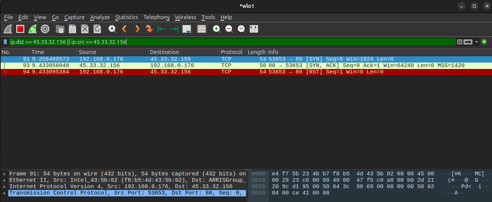
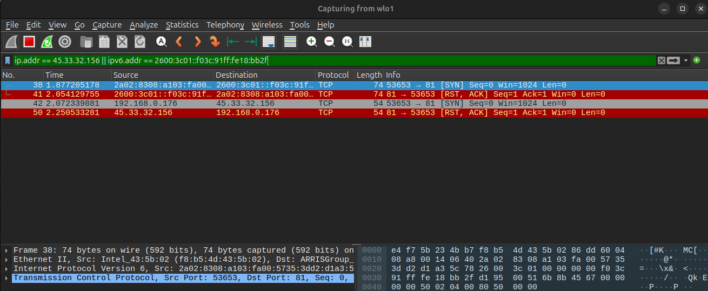
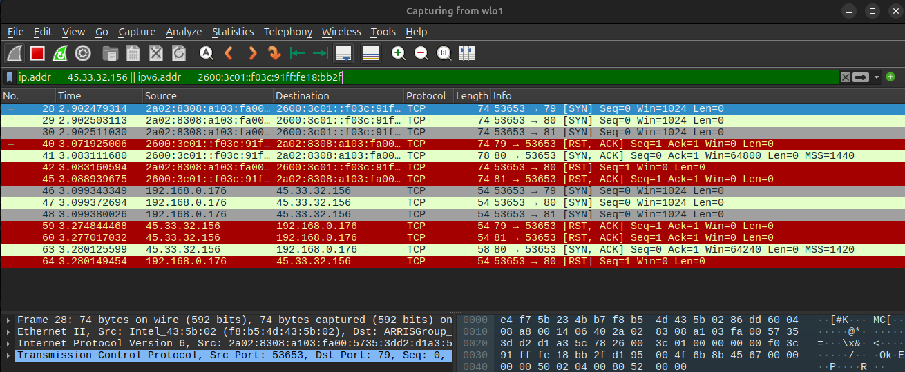
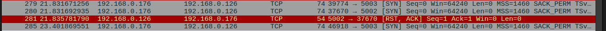
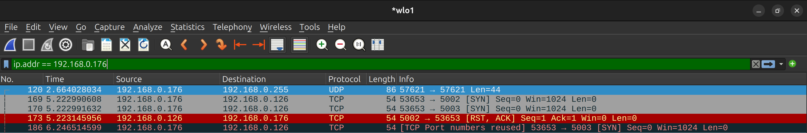
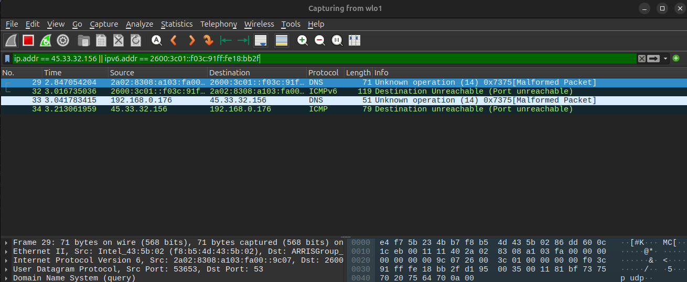
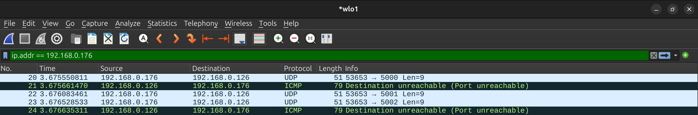

# IPK project 1 - L4 Scanner

## Overview

Simple network L4 scanner that works both for UDP and TCP protocol on IPV4 and IPV6 addresses. 
Program uses raw sockets for TCP (program builds own SYN packets) and DGRAM sockets for UDP 
to send probes on defined IP address / hostname while using threads per single address - one  is 
used for sending and checking timeout of each entry/probe, while the other is listening for replies 
using libpcap library.


## Build

Program can be compiled by running command `make` inside the root of the repository.
```bash
make
```

To remove everything created by `make` run `make clean`.
```bash
make clean
```

## Usage
>**PROGRAM MUST BE RUN USING ADMINISTRATOR PRIVILEGES DUE TO RAW SOCKETS**
```bash
./ipk-L4-scan -i INTERFACE [-t PORTS] [-u PORTS] HOST [-w TIMEOUT]
```
**Mandatory arguments** are `INTERFACE`, `HOST` and atleast one `PORT`

### Arguments
| Argument | Description | Required |
|----------|-------------|----------|
| `-i INTERFACE` | Source interface which will be used | Yes |
| `HOST` | Target hostname or IPV4/V6 addres | Yes |
| `-t PORTS` | TCP ports to scan | * |
| `-u PORTS` | UDP ports to scan  | * |
| `-w TIMEOUT` | Timeout in miliseconds for resending probes | No |
| `-h`, `--help` | Print usage | No |

\*Atleast one of PORT is required.

Each argument may be used at most 1 time due to implementation. All arguments may be used in any order. 
Ports must be in ranges 1-665535 and can be defined as (1-500 or 1,25,2 or 5 ) no cominations such as 1,25-20,5 are allowed.

### Examples

```bash
#print all avaibale interfaces
./ipk-L4-scan -i
```
```bash
#scan 2 localhost UDP ports
sudo ./ipk-L4-scan -i eth0 -u 53,67 localhost
```
```bash
#scan address for UDP and TCP ports
sudo ./ipk-L4-scan -i eth0 -u 80,440  192.168.0.1 -t 80,443
```
```bash
#send help message
./ipk-L4-scan --help
```
### Output format

Program outputs one or more lines each containing: `IP PORT PROTOCOL STATE`.

Example:
```bash
sudo ./ipk-L4-scan -i lo -t 80,443 localhost
```
```
127.0.0.1 80 tcp closed
127.0.0.1 443 tcp closed
```

## Implemented Features

### TCP scanning
Sending SYN packets to addresses through RAW sockets, based on the response port state is decided as such:
- RST packet -> port is ***closed***,
- SYN + ACK packet - > port is ***open***,
- No response `once` until timeout -> send TCP packet again,
- No response `twice` until timeout -> port is ***filtered***.

Tcp scanning creates own TCP header and if address is IPV4 also the IP header and does correct checksums.

### UDP scanning
Sending UDP messages to addresses through DGRAM sockets based on the response port state is decided as such:
- ICMP(type 3 code 3) response -> port is ***closed***,
- ICMPv6(type 4 code 1) response -> port is ***closed***,
- No response until timeout -> port is ***open***.

### Hostname
Program supports IPV4, IPV6 and also hostname as targets.
Hostname names are resolve using 'getaddrainfoo' into corresponding ip addresses for scanning.

### Signal handling
Program supports termination with `SIGINT` or `SIGTERM`, upon termination all allocated memory is freed and program exists with success.

### Errors and printing
Upon any error program prints error message to `stderr` and exits with a corresponding non-zero exit code.

| Exit Code | Name | Description |
|-----------|------|-------------|
| 0 | `ERR_SUCCESS` | Program completed successfully |
| 1 | `ERR_FAILURE` | General failure |
| 2 | `ERR_INVALID_ARGUMENT` | Invalid or missing argument |
| 3 | `ERR_GETIFADDRS` | Failed to resolve source interfaces |
| 4 | `ERR_HOSTNAME` | Failed to resolve target hostname |
| 5 | `ERR_SOCKET` | Everything related to socket(creation, binding, sending messages) |
| 6 | `ERR_NO_INTERFACE` | No interface not found or missing IPV4/IPV6 address |
| 7 | `ERR_PCAP` | Any libpcap error |
| 8 | `ERR_MUTEX` | Thread mutex initialization failed |
| 9 | `ERR_CLOCK` | Failed to resolve current time |
| 99 | `ERR_MALLOC` | Memory allocation failed |

### Program flow and design choices
1. **Parse arguments** - resolve all arguments and input them into `Scanner` struct for easy manipulation, using bitmaps to save memory.
2. **Resolve hostname** - get target ipaddress/-es by using `getaddrinfo`.
3. **Resolve interface** - get all interfaces and store one ipv4 and one global ipv6 into `Scanner` struct for easy manipulation.
4. **Init sockets** - create at most *4* socket for each send type(TCP-IPV4, TCP-IPV6, UDP-IPV4, UDP-ipv6), bind them or set options and store them into `Sockets` struct due to creating new socket fd being time demanding operation,
5. **Create `IPScan` struct** - which holds all data needed for scanning a single address:
    target/source addresses, socket file descriptors, pcap handler, mutex, and an array,
    of `ScanEntry` structs (one per port) tracking state and timeout of each entry.
6. **Scan addresses** - for each address:
    - reset `IPscan` struct(filter, target address, sockets),
    - create two threads - one for receiving(Send) and one for listening to responses(receive):
        - Send thread operates similar to FSM. Over each entry it decides what to do based on their state(either to send or set that its completed),while also tracking timeout time for each entry, also breaks Receive `pcap_loop` upon checking that all entries are completed
        - Receive thread runs `pcap_loop` which handles returning packets and setting corresponding States based on the response.
7. **cleanup** - after scanning all allocated memory is freed and program exits with success error code.

## Testing

### Testing environment
All tests were performed in Linux environment:
  - **OS**: `Ubuntu 24.04.4 LTS`
  - **GCC**: `14.3.0`
  - **GNU**: `Make 4.4.1`
  - **Tested interfaces**: `lo`, `wlo1` 
  - **libpcap**: `1.10.4`
  - **External tools**:
    - nmap: `7.94` - reference output
    - wireshark: `4.2.2` - packet tracking
>`SUDO` priviliges are required for testing the application

### Automated tests

Automatic tests were created to check whether program correctly parses arguments, sends correct message types to correct addresses.

#### Automated tests are run using:
```bash
  make test   #sudo privileges required
```
#### Automated tests test:
  - Correct argument parsing
  - Simple TCP scanning tests on localhost, both ipv4 and ipv6
  - Simple UDP scanning tests on localhost, both ipv4 and ipv6
  - Correct port ranges for ports
  - -i and -help flags

L**Logic of test script:**
The `test.sh` script tests closed ports by using ports that are not used by the system. 
Open ports are tested by temporarily opening ports using nc. 
The scanner output is then compared with expected values using grep and each test prints OK / FAIL.

#### Example automatic test
**Context:** A local TCP port (13350) is opened using `nc`.

**Command:**
```bash
./ipk-L4-scan -i lo -t 13350 localhost
```
**Expected output**
```bash
127.0.0.1 13350 tcp open
```

**Actual outputs:**
```bash
127.0.0.1 13350 tcp open
```
Test script checks whether expected output matches with actual output with grep

### Manual tests

Manual tests were used to determine whether scanner works on an actual network

#### Manual tests test:
- Scanning on a real interface and a VPN interface
- Scanning actual addresses (both external network addresses and LAN addresses)
- TCP testing for both IPv4 and IPv6
- UDP testing for both IPv4 and IPv6

Testing was performed by running the program against selected target ports on network hosts. 
Packets were tracked using Wireshark to verify correct behavior and the results were compared visually with those obtained from nmap.

Tests were performed primarily on the host `scanme.nmap.org`, which is widely used for validating network scanners and supports both IPv4 and IPv6.

**All commands are executed with administrator privileges**

Each manual test includes:
- the name of the test - header of test
- context - description of test
- program input (executed ``command``)
- expected output (based on results from `nmap` running the same scan)
- exit code
- corresponding packet capture screenshot of Wireshark


LAN tests packet captures screenshot of another device in the same network environment. 

**TCP tests**

#### TCP single port test 
**Context:** Scanning a known open TCP port on a remote host.

**Command:**
```bash
./ipk-L4-scan -i wlo1 -t 80 scanme.nmap.org
```

**Expected output:** (command `nmap -p 80 scanme.nmap.org` and `nmap -p 80 -6 scanme.nmap.org`)
```
45.33.32.156 80 tcp open
2600:3c01::f03c:91ff:fe18:bb2f 80 tcp open
```

```
**Actual output:**
2600:3c01::f03c:91ff:fe18:bb2f 80 tcp open
45.33.32.156 80 tcp open
```

**wireshark track**



#### TCP closed port test
**Context:** Scanning a TCP port expected to be closed on a remote host.

**Command:**
```bash
./ipk-L4-scan -i wlo1 -t 81 scanme.nmap.org
```

**Expected output:** (command `nmap -p 81 scanme.nmap.org` and `nmap -p 81 -6 scanme.nmap.org`)
```
45.33.32.156 81 tcp closed
2600:3c01::f03c:91ff:fe18:bb2f 81 tcp closed
```

**Actual output:**
```
2600:3c01::f03c:91ff:fe18:bb2f 81 tcp closed
45.33.32.156 81 tcp closed
```

**wireshark track**




#### TCP range port test
**Context:** Scanning a range of TCP ports.

**Command:**
```bash
./ipk-L4-scan -i wlo1 -t 79-81 scanme.nmap.org
```

**Expected output:** (command `nmap -p 79-81 scanme.nmap.org` and `nmap -p 79-81 -6 scanme.nmap.org`)
```
45.33.32.156 79 tcp closed
45.33.32.156 80 tcp open
45.33.32.156 81 tcp closed
2600:3c01::f03c:91ff:fe18:bb2f 79 tcp closed
2600:3c01::f03c:91ff:fe18:bb2f 80 tcp open
2600:3c01::f03c:91ff:fe18:bb2f 81 tcp closed
```

**Actual output:**
```
2600:3c01::f03c:91ff:fe18:bb2f 79 tcp closed
2600:3c01::f03c:91ff:fe18:bb2f 80 tcp open
2600:3c01::f03c:91ff:fe18:bb2f 81 tcp closed
45.33.32.156 79 tcp closed
45.33.32.156 80 tcp open
45.33.32.156 81 tcp closed
```
**wireshark track**



#### TCP LAN filtered check
**Context:** Scanning TCP ports on a local network device. (with approval of owner of the device)
**Context:** port 5003 was set to be filtered with `iptables -A INPUT -p tcp --dport 5003 -j DROP`

**Command:**
```bash
./ipk-L4-scan -i wlo1 -t 5002-5003 192.168.0.126
```

**Expected output:** (command `nmap -p 5002-5003 192.168.0.126`)
```
192.168.0.126 5002 tcp closed
192.168.0.126 5003 tcp filtered
```

**Actual output:**
```
192.168.0.126 5002 tcp closed
192.168.0.126 5003 tcp filtered
```
**wireshark track**
Sender POV:



Receiver POV:
5003 is dropped by firewal so it doesnt show (correct behaviour)



**UDP tests**

#### UDP single port test
**Context:** Scanning single UDP port

**Command:**
```bash
./ipk-L4-scan -i wlo1 -u 53 scanme.nmap.org
```

**Expected output:** (command `nmap -sU -p 53 scanme.nmap.org` and `nmap -sU -p 53 -6 scanme.nmap.org`)
```
45.33.32.156 53 udp closed
2600:3c01::f03c:91ff:fe18:bb2f 53 closed
```

**Actual output:**
```
2600:3c01::f03c:91ff:fe18:bb2f 53 udp closed
45.33.32.156 53 udp closed
```
**wireshark track**



#### UDP LAN open closed test
**Context:** Scanning UDP ports on a local network device. (with approval of owner of the device)
**Context:** port 5001 was opened with nc

**Command:**
```bash
./ipk-L4-scan -i wlo1 -u 5000-5002 192.168.0.126
```

**Expected output:** (command `sudo nmap -sU -p 5000-5002 192.168.0.126`) 
```
192.168.0.126 5000 udp closed
192.168.0.126 5001 udp open
192.168.0.126 5002 udp closed
```

**Actual output:**
```
192.168.0.126 5000 udp closed
192.168.0.126 5001 udp open
192.168.0.126 5002 udp closed
```
**wireshark track**

Program receiver POV:



## Ai usage
- AI model was used in this project in:
  -   formatting the README file (the content was written by author of this repo)
  -   generating local test cases based on the specified sample


## *Known* Limitations

- **Timeout precision** — timeout is checked inside a loop that iterates over all entries. 
  For large port ranges, by the time a specific entry is checked, more time may have passed than the set timeout, 
  causing a port to be marked different state that it would have even if a response arrived just after the threshold.

- **IPv6 source address mismatch** — when an interface has multiple global IPv6 addresses, 
the address the kernel uses for sending may differ from the one the program selected, causing responses to not be recognized.

- **Rate limiting** — all TCP entries share the same source port, which may trigger
  rate limiting or firewall rules on some targets.

## References

- [RFC 793 - Transmission Control Protocol](https://www.rfc-editor.org/rfc/rfc793)
- [TCP/IPv4/IPv6 checksum implementation](https://www.packetmania.net/en/2021/12/26/IPv4-IPv6-checksum/)
- [Sending raw Ethernet packets in C](https://austinmarton.wordpress.com/2011/09/14/sending-raw-ethernet-packets-from-a-specific-interface-in-c-on-linux/)
- [C signal handling](https://en.wikipedia.org/wiki/C_signal_handling)
- [pcap documentation](https://www.tcpdump.org/manpages/pcap.3pcap.html)
- [getaddrinfo man page](https://man7.org/linux/man-pages/man3/getaddrinfo.3.html)
- [pthread documentation](https://man7.org/linux/man-pages/man7/pthreads.7.html)
- [getifaddrs man page](https://man7.org/linux/man-pages/man3/getifaddrs.3.html)
- [errno man page](https://man7.org/linux/man-pages/man3/errno.3.html)